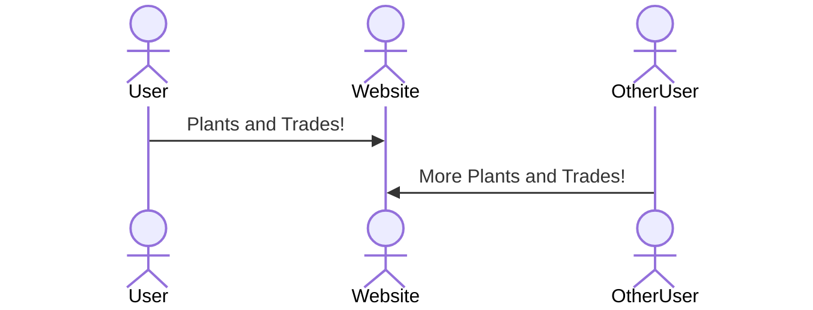

# Idle Garden

A small game where a user chooses plants to grow, sell, and trade, getting better a better garden and plants over time.

## 🚀 Specification Deliverable

> [!NOTE]
>  Fill in this sections as the submission artifact for this deliverable. You can refer to this [example](https://github.com/webprogramming260/startup-example/blob/main/README.md) for inspiration.

- [x] Proper use of Markdown in README.md
- [x] A concise and compelling elevator pitch in your README.md
- [x] Description of key features in your README.md
- [x] Description of how you will use each technology
- [x] One or more rough sketches of your application. Images must be embedded in your README.md.

### Elevator pitch

I am going to make an idle game where the user grows plants over time. They can then sell and by plants from others through an online auction. I'm hoping to make this auction similar to Facebook Marketplace, with chatting about the plant

### Design

There will be a home page for general updates on the app, a trading page for communication and transactions with other users, a profile page for user settings, like visibility status, blocking, and following other users, etc. Next are the core of the app: with a shop page, for buying seeds and other items that can be then used in the garden to grow a user's plants. As a user grows plants, they will be able to sell or trade them for money, allowing them to buy even better seeds and plants for their future garden. This combination of features will allow users to enjoy an experience of an interactive combination of efforts with other users as they all grow their individual gardens.

### Key features

- A Garden for users to grow plants over time
- A shop for users to buy and sell plants to upgrade their Garden
- A marketplace with other users for cooperation and other interaction.

### Technologies

I am going to use the required technologies in the following ways.

- **HTML** - The website will have text and images and other website functionality
- **CSS** - The site will have style
- **JavaScript** - Website functionality
- **React** - Interactive pages
- **Service** - Backend services will control time calculation and application data.
- **DB/Login** - There will be an account/user system to keep track of user's game-related data
- **WebSocket** - There will be real-time communication with other users

## 🚀 AWS deliverable

For this deliverable I did the following. I checked the box `[x]` and added a description for things I completed.

- [x] **Server deployed and accessible with custom domain name** - [My server link](https://pgarden.click).
I completed the EC2 instance setup, and got my site https certified.

## 🚀 HTML deliverable

For this deliverable I did the following. I checked the box `[x]` and added a description for things I completed.

- [x] **HTML pages** - I created HTML pages for all of my intended features.
- [x] **Proper HTML element usage** - I followed proper guidelines for HTML element formatting.
- [x] **Links** - I used links to connect the pages of my site.
- [x] **Text** - My project has sufficient text for task.
- [x] **3rd party API placeholder** - I have left notes denoting where I will use 3rd party API calls.
- [x] **Images** - I have added images to some of the functionality of my site.
- [x] **Login placeholder** - My site has a placeholder for a login system.
- [x] **DB data placeholder** - I have denoted where my site will use a database to handle its features.
- [x] **WebSocket placeholder** - I have denoted where my site will use WebSocket features to handle its features.

## 🚀 CSS deliverable

For this deliverable I did the following. I checked the box `[x]` and added a description for things I completed.

- [x] **Header, footer, and main content body** - I made a header!.
- [x] **Navigation elements** - It has navigation elements!.
- [x] **Responsive to window resizing** - It responds!.
- [x] **Application elements** - It should have all of the elements ready to recieve javascript.
- [x] **Application text content** - Their is text.
- [x] **Application images** - It has a couple of images.

## 🚀 React part 1: Routing deliverable

For this deliverable I did the following. I checked the box `[x]` and added a description for things I completed.

- [x] **Bundled using Vite** - It is bundled!
- [x] **Components** - There are components!
- [x] **Router** - There is a Router!

## 🚀 React part 2: Reactivity

For this deliverable I did the following. I checked the box `[x]` and added a description for things I completed.

- [x] **All functionality implemented or mocked out** - As functional as yo mama.
- [x] **Hooks** - Plenty of hooks used!.

## 🚀 Service deliverable

For this deliverable I did the following. I checked the box `[x]` and added a description for things I completed.

- [ ] **Node.js/Express HTTP service** - I did not complete this part of the deliverable.
- [ ] **Static middleware for frontend** - I did not complete this part of the deliverable.
- [ ] **Calls to third party endpoints** - I did not complete this part of the deliverable.
- [ ] **Backend service endpoints** - I did not complete this part of the deliverable.
- [ ] **Frontend calls service endpoints** - I did not complete this part of the deliverable.

## 🚀 DB/Login deliverable

For this deliverable I did the following. I checked the box `[x]` and added a description for things I completed.

- [ ] **User registration** - I did not complete this part of the deliverable.
- [ ] **User login and logout** - I did not complete this part of the deliverable.
- [ ] **Stores data in MongoDB** - I did not complete this part of the deliverable.
- [ ] **Stores credentials in MongoDB** - I did not complete this part of the deliverable.
- [ ] **Restricts functionality based on authentication** - I did not complete this part of the deliverable.

## 🚀 WebSocket deliverable

For this deliverable I did the following. I checked the box `[x]` and added a description for things I completed.

- [ ] **Backend listens for WebSocket connection** - I did not complete this part of the deliverable.
- [ ] **Frontend makes WebSocket connection** - I did not complete this part of the deliverable.
- [ ] **Data sent over WebSocket connection** - I did not complete this part of the deliverable.
- [ ] **WebSocket data displayed** - I did not complete this part of the deliverable.
- [ ] **Application is fully functional** - I did not complete this part of the deliverable.
